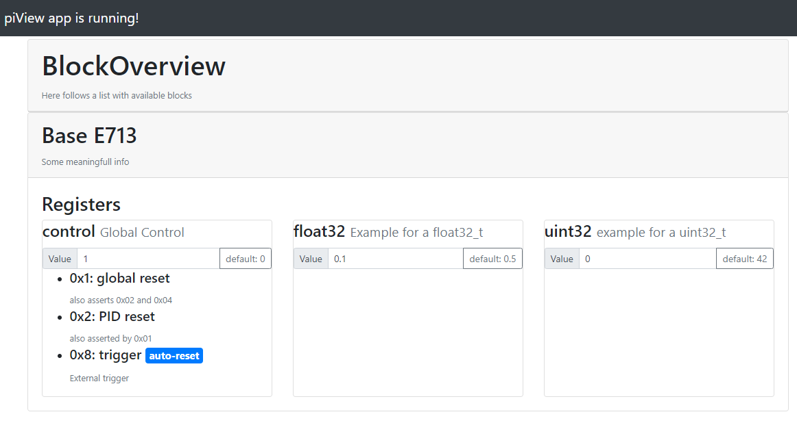

# E713 - PyView

A FPGA block overview using a Flask Banckend and an angular frontend.
Before Running the application please make sure your prereqs are fulfilled as described in the Setup section.

### Structure
Within the `backend` folder contains a python project, serving a [flask_restful](https://flask-restful.readthedocs.io/en/latest/) api.
The `frontend` folder is a [angular](angular.io) app, that visualizes the contents of the api.

## Run

- Run the flask backend with your config

    `python -m piView.serve example/config.yml`

  For debuging environment use the -debug flag

    `python -m piView.serve example/config.yml -debug`

- Serve the Angular frontend.

`    cd frontend;`
`    ng serve`

Your local page should the look like this

## Setup

This package uses venv module.

    python -m venv .venv

To acrivate the environment using PowerShell

    # optionally allo remote signed scripts for current user
    Set-ExecutionPolicy -ExecutionPolicy RemoteSigned -Scope CurrentUser

    .venv/Scripts/Activate.ps1

### Requirements

#### Backend

Install anything you need to your newly created environment

    pip install -r requirements.txt

Adding Packages can ba done via pip.

    pip install <some_package>

Requirements might be frozen to document dependencies.

    pip freeze > requirements.txt

##### Install PiView

We make use of setuptools in the `setup.py`

    python setup.py install

For developers consider running. The `--user` flag has to be ommited when installing in (venv)

    python setup.py develop --user

### Frontend

- First install [NodeJs](https://nodejs.org/)
- Then add [angular cli](https://cli.angular.io/)

    `npm install -g @angular/clo`

### Test

In order to test the Backend use pythons unittests

    python -m unittest discover backend/Test Test*.py
